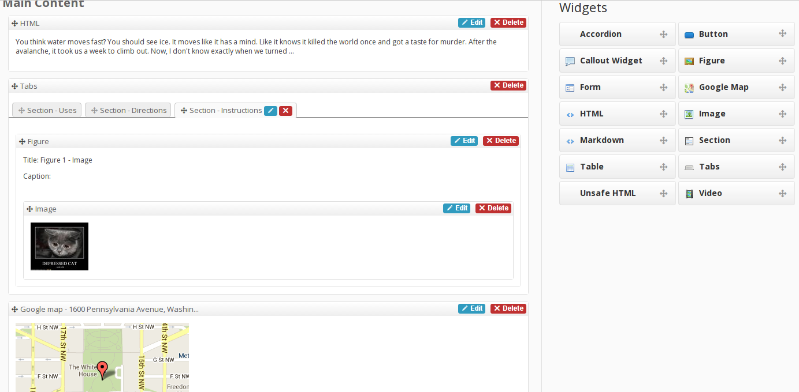
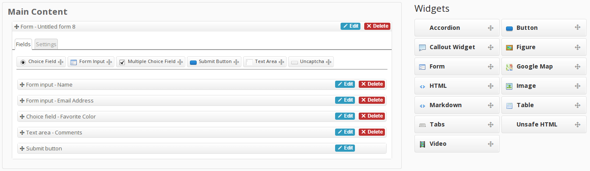

Editor
======

Widgy provides a drag and drop JavaScript editor interface to the tree in the
form of a Django formfield.

The editor is built on Backbone.js and RequireJS to provide a modular and
customizable interface.

